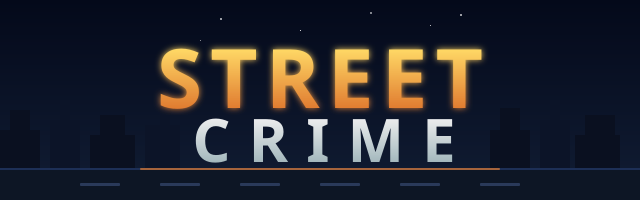

<div align="center">
  
  <br/><br/>

  **[▶ Play now on GitHub Pages](https://isocialpractice.github.io/street-crime/)**

</div>

---

> Very much a work-in-progress, but still - this has been a fun project.

A classic 2.5D side-scrolling beat-em-up built entirely in vanilla HTML5 Canvas with no frameworks or dependencies. Take to the streets and fight through waves of criminals to reach the boss.

## Controls

| Action | Keys |
|---|---|
| Move | Arrow keys or WASD |
| Run | Hold Shift + direction |
| Punch | J or Z |
| Kick | K or X |
| Uppercut | J/Z + Up |
| Running Kick | K/X while running |
| Jump | Space |
| Jump Attack | J/Z or K/X while airborne |
| Pause | P |

## Features

- 2.5D beat-em-up movement and combat
- Combo system with multiplier display
- Enemy AI with flanking, queued rushing, and attack cooldowns
- Unique per-character attack sprites (punch, kick) with frame-hold timing
- Enemy separation — characters spread to strategic positions rather than stacking
- Boss and sub-boss encounters with dedicated health bars
- Breakable objects that drop health pickups
- Per-character sprite scaling and data-driven enemy asset animation configuration
- Debug mode with live tuning sliders and a built-in sprite viewer
- Debug Level mode that loads an SVG scene and uses its `#field` shape for walkable bounds and sandbox spawn sampling

## Tech

Pure vanilla JavaScript — no build step, no bundler, no dependencies. Open `index.html` in a browser and play.

Enemy asset wiring now lives in `config/enemy-assets.json`, while gameplay tuning remains in `config/enemies.json` and sprite scaling stays in `config/characters.json`.

The title screen now includes a `DEBUG LEVEL` entry that loads `levels/Test_ItWorked.svg`. The scene image is drawn as the background, and any SVG shape with `id="field"` becomes the authoritative gameplay area for movement. Player and enemy positions are projected onto that shape, and the same field geometry is used for debug object and enemy spawn sampling.

```
assets.js   — SVG sprite loader, all image assets
game.js     — game engine, entities, AI, level manager, HUD
style.css   — layout and UI styling
index.html  — canvas and DOM shell
```

## License

See [LICENSE](LICENSE).
